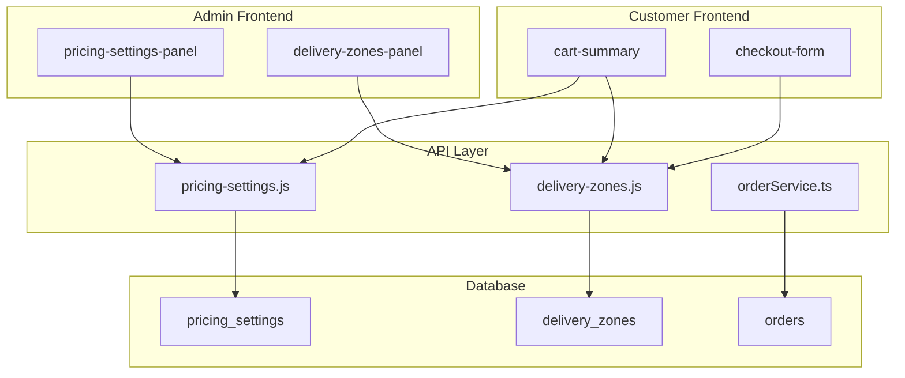

# Karebe Pricing System Implementation Plan

## Executive Summary

This plan outlines the implementation of a comprehensive, configurable pricing system for Karebe e-commerce platform. The current system has hardcoded pricing values that cannot be modified by administrators. This implementation will make every aspect of price calculation explicit and configurable through the admin interface.

## Current Issues Identified

### 1. Hardcoded Delivery Fee
**Location**: [`karebe-react/src/features/cart/components/cart-summary.tsx:34`](karebe-react/src/features/cart/components/cart-summary.tsx:34)
```typescript
const deliveryFee = subtotal > 5000 ? 0 : 300;
```
- Free delivery threshold hardcoded to 5000 KES
- Base delivery fee hardcoded to 300 KES
- No distance-based calculation

### 2. Hardcoded Tax Rate
**Location**: [`karebe-react/src/features/cart/components/cart-summary.tsx:33`](karebe-react/src/features/cart/components/cart-summary.tsx:33)
```typescript
const tax = subtotal * 0.16; // 16% VAT
```
- VAT rate hardcoded at 16%

### 3. No Delivery Fee in Orders
**Location**: [`karebe-orchestration/supabase/migrations/000_base_schema.sql:47`](karebe-orchestration/supabase/migrations/000_base_schema.sql:47)
- Orders table only has `total_amount` field
- No separate tracking of delivery fees

---

## Implementation Plan

### Phase 1: Database Schema Changes

#### 1.1 Pricing Settings Table
Create table `pricing_settings` to store global pricing configuration:

```sql
CREATE TABLE IF NOT EXISTS pricing_settings (
  id UUID PRIMARY KEY DEFAULT gen_random_uuid(),
  key VARCHAR(100) UNIQUE NOT NULL,
  value JSONB NOT NULL,
  description TEXT,
  is_active BOOLEAN DEFAULT TRUE,
  created_at TIMESTAMPTZ DEFAULT NOW(),
  updated_at TIMESTAMPTZ DEFAULT NOW()
);
```

**Settings to be stored:**
- `base_delivery_fee`: Base fee for delivery (default: 300)
- `free_delivery_threshold`: Order total for free delivery (default: 5000)
- `vat_rate`: VAT/tax percentage (default: 0.16)
- `min_order_amount`: Minimum order amount (default: 0)
- `max_delivery_distance_km`: Maximum delivery distance (default: 15)

#### 1.2 Delivery Zones Table
Create table `delivery_zones` for distance-based pricing:

```sql
CREATE TABLE IF NOT EXISTS delivery_zones (
  id UUID PRIMARY KEY DEFAULT gen_random_uuid(),
  name VARCHAR(100) NOT NULL,
  branch_id TEXT REFERENCES branches(id),
  min_distance_km DECIMAL(6,2) NOT NULL,
  max_distance_km DECIMAL(6,2) NOT NULL,
  fee DECIMAL(10,2) NOT NULL,
  is_active BOOLEAN DEFAULT TRUE,
  sort_order INTEGER DEFAULT 0,
  created_at TIMESTAMPTZ DEFAULT NOW(),
  updated_at TIMESTAMPTZ DEFAULT NOW()
);
```

**Default zones to seed:**
| Name | Min Distance (km) | Max Distance (km) | Fee (KES) |
|------|-------------------|-------------------|-----------|
| Zone A (0-2km) | 0 | 2 | 150 |
| Zone B (2-5km) | 2 | 5 | 300 |
| Zone C (5-10km) | 5 | 10 | 500 |
| Zone D (10-15km) | 10 | 15 | 800 |

#### 1.3 Update Orders Table
Add `delivery_fee` and `vat_amount` fields to orders:

```sql
ALTER TABLE orders 
ADD COLUMN IF NOT EXISTS delivery_fee DECIMAL(10,2) DEFAULT 0,
ADD COLUMN IF NOT EXISTS vat_amount DECIMAL(10,2) DEFAULT 0,
ADD COLUMN IF NOT EXISTS delivery_zone_id UUID REFERENCES delivery_zones(id),
ADD COLUMN IF NOT EXISTS distance_km DECIMAL(6,2);
```

---

### Phase 2: API Endpoints

#### 2.1 Pricing Settings API
**File**: `api/admin/pricing-settings.js`

| Method | Endpoint | Description |
|--------|----------|-------------|
| GET | /api/admin/pricing-settings | Get all pricing settings |
| GET | /api/admin/pricing-settings?key=xxx | Get specific setting |
| PUT | /api/admin/pricing-settings | Update settings |

#### 2.2 Delivery Zones API
**File**: `api/admin/delivery-zones.js`

| Method | Endpoint | Description |
|--------|----------|-------------|
| GET | /api/admin/delivery-zones | List all zones |
| POST | /api/admin/delivery-zones | Create zone |
| PUT | /api/admin/delivery-zones | Update zone |
| DELETE | /api/admin/delivery-zones | Delete zone |

#### 2.3 Update Order Creation
**File**: `karebe-orchestration/src/services/orderService.ts`

Update [`createOrder()`](karebe-orchestration/src/services/orderService.ts:34) to:
- Accept `delivery_zone_id` and `distance_km` in request
- Calculate delivery fee based on zone
- Calculate VAT on subtotal
- Store all values in order record

---

### Phase 3: React Admin Interface

#### 3.1 Pricing Settings Panel
**File**: `karebe-react/src/features/admin/components/pricing-settings-panel.tsx`

**UI Components:**
- Input fields for each pricing setting
- Real-time preview of calculations
- Save/Reset buttons

**Settings to configure:**
1. Base Delivery Fee (KES)
2. Free Delivery Threshold (KES)
3. VAT Rate (%)
4. Minimum Order Amount (KES)
5. Maximum Delivery Distance (km)

#### 3.2 Delivery Zones Management
**File**: `karebe-react/src/features/admin/components/delivery-zones-panel.tsx`

**UI Components:**
- Table listing all zones with edit/delete actions
- Add new zone form/dialog
- Drag-to-reorder for zone priority
- Toggle active/inactive

**Zone Properties:**
- Zone Name
- Branch (optional, for branch-specific pricing)
- Min Distance (km)
- Max Distance (km)
- Fee (KES)

---

### Phase 4: Frontend Integration

#### 4.1 Pricing Settings Store
**File**: `karebe-react/src/features/admin/stores/pricing-settings.ts`

Create store to fetch and cache pricing settings.

#### 4.2 Update Cart Summary
**File**: `karebe-react/src/features/cart/components/cart-summary.tsx`

Replace hardcoded values:
```typescript
// BEFORE
const tax = subtotal * 0.16;
const deliveryFee = subtotal > 5000 ? 0 : 300;

// AFTER - fetch from settings
const tax = subtotal * (pricingSettings.vatRate || 0.16);
const deliveryFee = calculateDeliveryFee(subtotal, distanceKm, pricingSettings);
```

#### 4.3 Distance Selection UI
**File**: `karebe-react/src/features/checkout/components/checkout-form.tsx`

Add distance/location selector in checkout flow:
- Dropdown or auto-detect based on address
- Show applicable zone and fee before order

---

### Phase 5: Migration & Seeding

#### 5.1 Migration Script
Create SQL migration to add new tables and fields.

#### 5.2 Seed Data
Populate default pricing settings and delivery zones on first run.

---

## Architecture Diagram



---

## Implementation Priority

| Priority | Task | Complexity |
|----------|------|------------|
| 1 | Database schema (tables + migration) | Medium |
| 2 | Pricing Settings API | Low |
| 3 | Delivery Zones API | Low |
| 4 | Update order creation logic | Medium |
| 5 | Admin Pricing Settings Panel | Medium |
| 6 | Admin Delivery Zones Panel | Medium |
| 7 | Frontend cart integration | Low |
| 8 | Checkout distance selection | Medium |

---

## Files to Modify/Create

### New Files
- `api/admin/pricing-settings.js` - Pricing settings API
- `api/admin/delivery-zones.js` - Delivery zones API
- `karebe-react/src/features/admin/components/pricing-settings-panel.tsx` - Admin UI
- `karebe-react/src/features/admin/components/delivery-zones-panel.tsx` - Admin UI
- `karebe-react/src/features/admin/stores/pricing-settings.ts` - Settings store

### Modified Files
- `karebe-orchestration/supabase/migrations/` - Add migration
- `karebe-orchestration/src/services/orderService.ts` - Add delivery fee calculation
- `karebe-react/src/features/cart/components/cart-summary.tsx` - Use configurable values
- `karebe-react/src/features/checkout/components/checkout-form.tsx` - Add zone selection

---

## Success Criteria

1. ✅ All pricing values configurable via admin interface
2. ✅ Delivery fee calculated based on distance zones
3. ✅ VAT/tax calculated from configurable rate
4. ✅ Order records include item total, delivery fee, and tax separately
5. ✅ Admin can add/edit/remove delivery zones
6. ✅ Frontend displays correct fees based on configuration