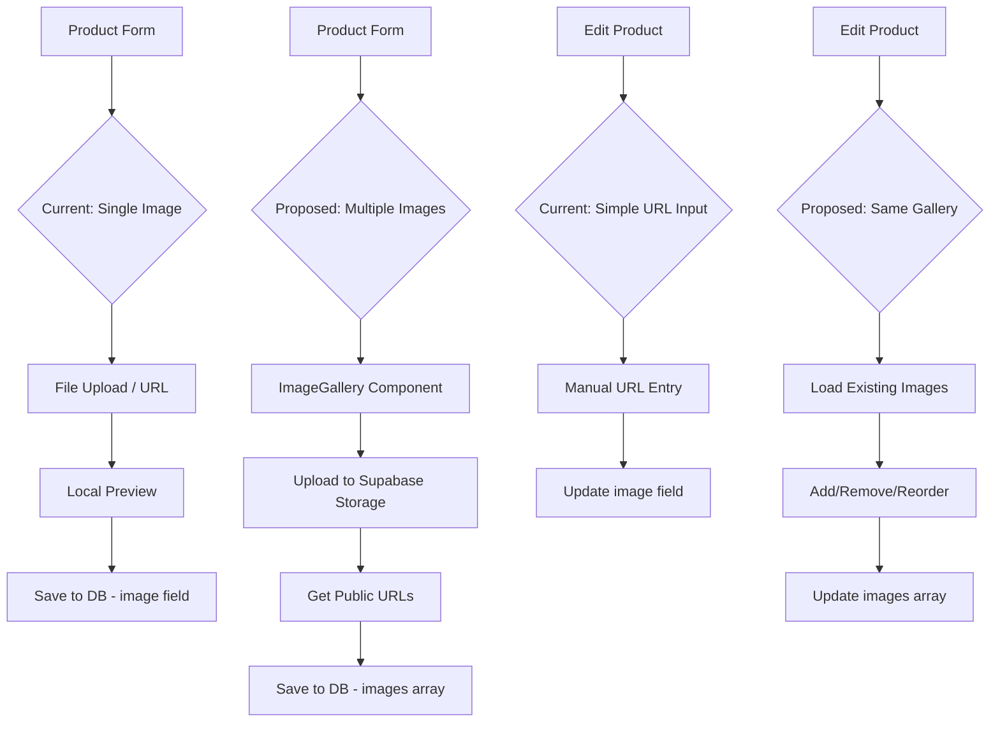

# Product Image Handling Plan

## Summary of Findings

### 1. Where are images uploaded and stored?

Images are stored in **Supabase Storage** in a bucket called **`product-images`** ([`product-manager.ts:280`](karebe-react/src/features/admin/services/product-manager.ts:280)).

The upload flow:
- Images are uploaded using `ProductManager.uploadProductImage(file)` which:
  - Creates a path: `products/${timestamp}-${random}.${ext}`
  - Uploads to Supabase Storage bucket `product-images`
  - Returns the public URL

### 2. Can a product have multiple images?

**Yes and No - there's inconsistency:**

| Component | Field | Type | Supports Multiple? |
|-----------|-------|------|-------------------|
| [`products` table](karebe-react/src/features/products/api/create-product.ts:26) | `images` | `string[]` | **Yes** |
| [`ProductManager`](karebe-react/src/features/admin/services/product-manager.ts:38) | `image` | `string` (single) | **No** |
| [`demo-data.ts`](karebe-react/src/lib/demo-data.ts:203) | `images` | `string[]` | **Yes** |

**Current state:**
- The modern API ([`create-product.ts`](karebe-react/src/features/products/api/create-product.ts)) supports `images: string[]` array
- The admin UI ([`products.tsx`](karebe-react/src/pages/admin/products.tsx)) only supports a single image via `image_url` field
- The database has both `image` (single) and `images` (array) columns

### 3. Can we reuse the image component in edit product?

**Current situation:**

The Add Product form has an [`ImageUploadSection`](karebe-react/src/pages/admin/products.tsx:185) component that provides:
- File upload with progress simulation
- URL input
- Camera capture mode
- Preview with remove functionality

The Edit Product dialog only has a simple text input for Image URL ([line 763-768](karebe-react/src/pages/admin/products.tsx:763)).

**Yes, we can create a reusable component** - here's the plan:

---

## Action Plan

### Step 1: Create Reusable Image Gallery Component

Create a new component at `karebe-react/src/components/ui/image-gallery.tsx`:

```
Props:
- images: string[] (current images)
- onImagesChange: (images: string[]) => void
- maxImages?: number (default: 5)
- uploadPath?: string (for Supabase storage path)
```

Features:
- Display grid of image thumbnails with remove buttons
- Drag-and-drop reordering
- Add new images via upload or URL
- Real upload to Supabase Storage
- Image preview on click

### Step 2: Update Product Manager

Update `karebe-react/src/features/admin/services/product-manager.ts`:
- Add `uploadMultipleImages(files: File[]): Promise<string[]>` method
- Support both single `image` and array `images` for backward compatibility

### Step 3: Update Add Product Form

In `karebe-react/src/pages/admin/products.tsx`:
- Replace `ImageUploadSection` with new `ImageGallery` component
- Store images as array instead of single URL

### Step 4: Update Edit Product Dialog

In `karebe-react/src/pages/admin/products.tsx`:
- Add the same `ImageGallery` component to edit dialog
- Load existing images when opening edit dialog
- Allow add/remove/reorder images

### Step 5: Database Migration (Optional)

If needed, create migration to normalize the database:
- Use `images` array as primary field
- Migrate data from `image` to `images[0]`

---

## Mermaid: Current vs Proposed Flow



---

## Files to Modify

1. **Create:** `karebe-react/src/components/ui/image-gallery.tsx`
2. **Modify:** `karebe-react/src/features/admin/services/product-manager.ts`
3. **Modify:** `karebe-react/src/pages/admin/products.tsx` (Add Product + Edit Dialog)
4. **Optional:** Database migration for `images` array normalization