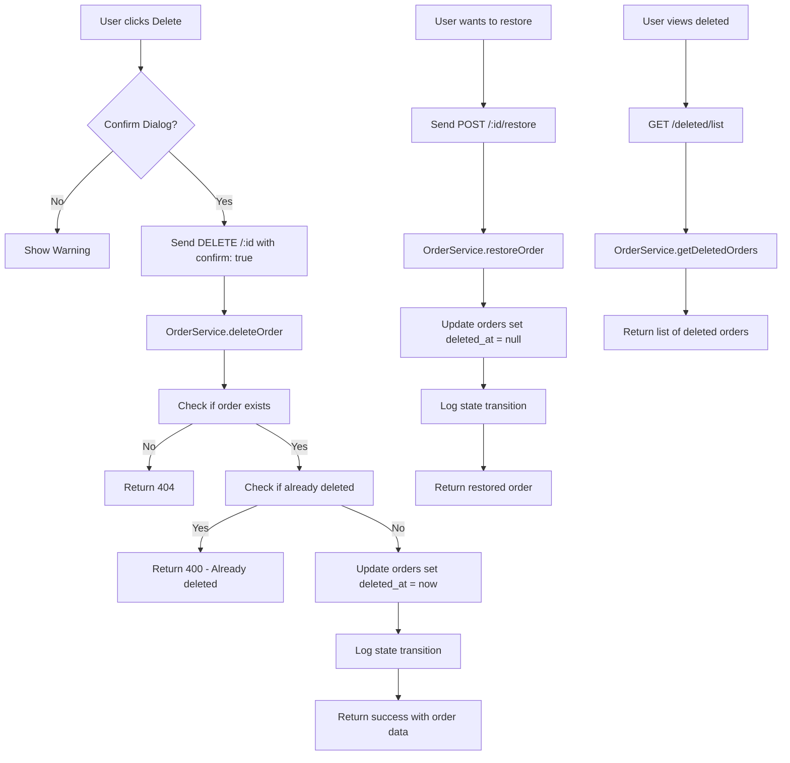

# Orders Soft Delete Implementation Plan

## Overview
This plan implements soft delete functionality for the orders module in the Karebe orchestration service. Orders will be marked as deleted using a `deleted_at` timestamp rather than being permanently removed from the database.

## Current State Analysis

### Existing Files
- **Database Schema**: [`karebe-orchestration/orchestration-service/supabase/migrations/000_base_schema.sql`](karebe-orchestration/orchestration-service/supabase/migrations/000_base_schema.sql) - Orders table without soft delete
- **Order Routes**: [`karebe-orchestration/orchestration-service/src/routes/orders.ts`](karebe-orchestration/orchestration-service/src/routes/orders.ts) - No DELETE endpoint
- **Order Types**: [`karebe-orchestration/orchestration-service/src/types/order.ts`](karebe-orchestration/orchestration-service/src/types/order.ts) - Order interface without deleted fields
- **Order Service**: [`karebe-orchestration/orchestration-service/src/services/orderService.ts`](karebe-orchestration/orchestration-service/src/services/orderService.ts) - getOrder/getOrdersByStatus queries need modification

### Existing Endpoints
- `POST /` - Create order
- `GET /:id` - Get order by ID
- `GET /` - Get orders by status
- `PATCH /:id/status` - Update order status
- `PATCH /:id` - Update order details
- `POST /:id/cancel` - Cancel order
- `POST /:id/assign-rider` - Assign rider
- `POST /:id/start-delivery` - Start delivery
- `POST /:id/complete` - Complete order
- `GET /:id/history` - Get order history
- `POST /:id/lock` - Acquire lock
- `DELETE /:id/lock` - Release lock

---

## Implementation Steps

### Phase 1: Database Schema Changes

#### Step 1.1: Add soft delete column to orders table
Create a new migration file: `karebe-orchestration/orchestration-service/supabase/migrations/003_soft_delete_orders.sql`

```sql
-- Add deleted_at column for soft delete
ALTER TABLE orders 
ADD COLUMN IF NOT EXISTS deleted_at TIMESTAMPTZ;

-- Add deleted_by column to track who deleted the order
ALTER TABLE orders 
ADD COLUMN IF NOT EXISTS deleted_by UUID;

-- Add index for querying deleted orders
CREATE INDEX IF NOT EXISTS idx_orders_deleted_at ON orders(deleted_at);

-- Create function to auto-update updated_at
CREATE OR REPLACE FUNCTION update_updated_at_column()
RETURNS TRIGGER AS $$
BEGIN
  NEW.updated_at = NOW();
  RETURN NEW;
END;
$$ language 'plpgsql';

-- Create trigger to update updated_at
DROP TRIGGER IF EXISTS update_orders_updated_at ON orders;
CREATE TRIGGER update_orders_updated_at
  BEFORE UPDATE ON orders
  FOR EACH ROW
  EXECUTE FUNCTION update_updated_at_column();
```

### Phase 2: TypeScript Types

#### Step 2.1: Update Order interface
Add `deleted_at` and `deleted_by` fields to the Order interface in [`order.ts`](karebe-orchestration/orchestration-service/src/types/order.ts:123):

```typescript
export interface Order {
  // ... existing fields
  deleted_at?: string | null;  // Timestamp when order was soft deleted
  deleted_by?: string | null;   // User who deleted the order
}
```

#### Step 2.2: Add new request/response types
Add these new types to support soft delete operations:

```typescript
// Request types
export interface DeleteOrderRequest {
  actor_type: ActorType;
  actor_id: string;
  reason?: string;  // Optional reason for deletion
  confirm: boolean; // Must be true to confirm deletion
}

export interface RestoreOrderRequest {
  actor_type: ActorType;
  actor_id: string;
}

// Response types
export interface DeletedOrderResponse {
  success: boolean;
  data?: Order;
  message: string;
}

export interface ListDeletedOrdersResponse {
  success: boolean;
  data: Order[];
  count: number;
}
```

### Phase 3: Order Service Modifications

#### Step 3.1: Add soft delete methods to OrderService
Add these methods to [`orderService.ts`](karebe-orchestration/orchestration-service/src/services/orderService.ts):

```typescript
/**
 * Soft delete an order
 */
async deleteOrder(
  orderId: string,
  actorType: ActorType,
  actorId: string,
  reason?: string
): Promise<Order> {
  // Check if order exists
  const order = await this.getOrder(orderId);
  if (!order) {
    throw new Error(`Order not found: ${orderId}`);
  }
  
  // Check if already deleted
  if (order.deleted_at) {
    throw new Error('Order is already deleted');
  }
  
  // Perform soft delete
  const { data, error } = await supabase
    .from('orders')
    .update({
      deleted_at: new Date().toISOString(),
      deleted_by: actorId,
      metadata: {
        ...order.metadata,
        deletion_reason: reason,
        deleted_by_type: actorType,
      },
    })
    .eq('id', orderId)
    .select()
    .single();
    
  if (error) {
    logger.error('Failed to soft delete order', { error, orderId });
    throw new Error(`Failed to delete order: ${error.message}`);
  }
  
  // Log the deletion
  await this.logStateTransition(orderId, {
    action: 'order_deleted',
    actor_type: actorType,
    actor_id: actorId,
    metadata: { reason },
  });
  
  return data as Order;
}

/**
 * Restore a soft-deleted order
 */
async restoreOrder(
  orderId: string,
  actorType: ActorType,
  actorId: string
): Promise<Order> {
  const order = await this.getOrder(orderId);
  if (!order) {
    throw new Error(`Order not found: ${orderId}`);
  }
  
  if (!order.deleted_at) {
    throw new Error('Order is not deleted');
  }
  
  const { data, error } = await supabase
    .from('orders')
    .update({
      deleted_at: null,
      deleted_by: null,
    })
    .eq('id', orderId)
    .select()
    .single();
    
  if (error) {
    logger.error('Failed to restore order', { error, orderId });
    throw new Error(`Failed to restore order: ${error.message}`);
  }
  
  await this.logStateTransition(orderId, {
    action: 'order_restored',
    actor_type: actorType,
    actor_id: actorId,
  });
  
  return data as Order;
}

/**
 * Get all soft-deleted orders
 */
async getDeletedOrders(branchId?: string): Promise<Order[]> {
  let query = supabase
    .from('orders')
    .select('*, items:order_items(*)')
    .not('deleted_at', 'is', null)
    .order('deleted_at', { ascending: false });

  if (branchId) {
    query = query.eq('branch_id', branchId);
  }

  const { data, error } = await query;

  if (error) {
    logger.error('Failed to get deleted orders', { error });
    throw new Error(`Failed to get deleted orders: ${error.message}`);
  }

  return data as Order[];
}

/**
 * Permanently delete an order and all related data
 */
async permanentlyDeleteOrder(orderId: string): Promise<void> {
  // First verify it's already soft deleted
  const order = await this.getOrder(orderId);
  if (!order?.deleted_at) {
    throw new Error('Only soft-deleted orders can be permanently deleted');
  }
  
  // Delete order items first (due to foreign key)
  const { error: itemsError } = await supabase
    .from('order_items')
    .delete()
    .eq('order_id', orderId);
    
  if (itemsError) {
    throw new Error(`Failed to delete order items: ${itemsError.message}`);
  }
  
  // Delete state transitions
  await supabase
    .from('order_state_transitions')
    .delete()
    .eq('order_id', orderId);
    
  // Finally delete the order
  const { error } = await supabase
    .from('orders')
    .delete()
    .eq('id', orderId);
    
  if (error) {
    throw new Error(`Failed to permanently delete order: ${error.message}`);
  }
}
```

#### Step 3.2: Modify existing queries to exclude deleted orders
Update `getOrder` and `getOrdersByStatus` to filter out deleted orders by default:

```typescript
async getOrder(orderId: string, includeDeleted = false): Promise<Order | null> {
  let query = supabase
    .from('orders')
    .select(`*, items:order_items(*)`)
    .eq('id', orderId);
    
  if (!includeDeleted) {
    query = query.is('deleted_at', null);
  }
  
  const { data, error } = await query.single();
  // ... rest of method
}

async getOrdersByStatus(
  status: OrderStatus, 
  branchId?: string,
  includeDeleted = false
): Promise<Order[]> {
  let query = supabase
    .from('orders')
    .select('*')
    .eq('status', status);
    
  if (!includeDeleted) {
    query = query.is('deleted_at', null);
  }
  
  // ... rest of method
}
```

### Phase 4: API Routes

#### Step 4.1: Add DELETE endpoint
Add to [`orders.ts`](karebe-orchestration/orchestration-service/src/routes/orders.ts:617):

```typescript
/**
 * DELETE /api/orders/:id
 * Soft delete an order
 */
router.delete('/:id', async (req: Request, res: Response) => {
  try {
    const orderId = req.params.id;
    const { actor_type, actor_id, reason, confirm } = req.body;
    
    // Validate required fields
    if (!actor_type || !actor_id) {
      return res.status(400).json({
        success: false,
        error: 'actor_type and actor_id required',
      });
    }
    
    // Require explicit confirmation
    if (!confirm) {
      return res.status(400).json({
        success: false,
        error: 'Confirmation required',
        message: 'You must set confirm: true to delete this order',
        warning: 'This action will soft-delete the order. It can be restored from the deleted orders section.',
      });
    }
    
    const order = await orderService.deleteOrder(
      orderId, 
      actor_type, 
      actor_id, 
      reason
    );
    
    res.json({
      success: true,
      data: order,
      message: 'Order deleted successfully',
      note: 'Order has been soft-deleted and can be restored from the deleted orders section.',
    });
  } catch (error) {
    const errorMessage = error instanceof Error ? error.message : 'Unknown error';
    logger.error('Error deleting order', { error, orderId: req.params.id });
    
    if (errorMessage.includes('not found')) {
      return res.status(404).json({
        success: false,
        error: 'Order not found',
      });
    }
    
    if (errorMessage.includes('already deleted')) {
      return res.status(400).json({
        success: false,
        error: 'Order already deleted',
      });
    }
    
    res.status(500).json({
      success: false,
      error: 'Failed to delete order',
      message: errorMessage,
    });
  }
});
```

#### Step 4.2: Add restore endpoint

```typescript
/**
 * POST /api/orders/:id/restore
 * Restore a soft-deleted order
 */
router.post('/:id/restore', async (req: Request, res: Response) => {
  try {
    const orderId = req.params.id;
    const { actor_type, actor_id } = req.body;
    
    if (!actor_type || !actor_id) {
      return res.status(400).json({
        success: false,
        error: 'actor_type and actor_id required',
      });
    }
    
    const order = await orderService.restoreOrder(orderId, actor_type, actor_id);
    
    res.json({
      success: true,
      data: order,
      message: 'Order restored successfully',
    });
  } catch (error) {
    const errorMessage = error instanceof Error ? error.message : 'Unknown error';
    logger.error('Error restoring order', { error, orderId: req.params.id });
    
    if (errorMessage.includes('not found')) {
      return res.status(404).json({
        success: false,
        error: 'Order not found',
      });
    }
    
    if (errorMessage.includes('not deleted')) {
      return res.status(400).json({
        success: false,
        error: 'Order is not deleted',
      });
    }
    
    res.status(500).json({
      success: false,
      error: 'Failed to restore order',
      message: errorMessage,
    });
  }
});
```

#### Step 4.3: Add endpoint to list deleted orders

```typescript
/**
 * GET /api/orders/deleted
 * Get all soft-deleted orders
 */
router.get('/deleted/list', async (req: Request, res: Response) => {
  try {
    const { branch_id } = req.query;
    
    const orders = await orderService.getDeletedOrders(branch_id as string | undefined);
    
    res.json({
      success: true,
      data: orders,
      count: orders.length,
      message: `Found ${orders.length} deleted order(s)`,
    });
  } catch (error) {
    logger.error('Error getting deleted orders', { error });
    res.status(500).json({
      success: false,
      error: 'Failed to get deleted orders',
    });
  }
});
```

#### Step 4.4: Add permanent delete endpoint (admin only)

```typescript
/**
 * DELETE /api/orders/:id/permanent
 * Permanently delete an order (irreversible)
 */
router.delete('/:id/permanent', async (req: Request, res: Response) => {
  try {
    const orderId = req.params.id;
    const { actor_type, actor_id, confirm } = req.body;
    
    if (!actor_type || !actor_id) {
      return res.status(400).json({
        success: false,
        error: 'actor_type and actor_id required',
      });
    }
    
    if (!confirm) {
      return res.status(400).json({
        success: false,
        error: 'Confirmation required',
        message: 'This action is irreversible. Set confirm: true to proceed.',
        warning: 'Permanently deleting an order will remove all related data including order items and history. This cannot be undone.',
      });
    }
    
    await orderService.permanentlyDeleteOrder(orderId);
    
    res.json({
      success: true,
      message: 'Order permanently deleted',
      warning: 'All order data has been removed and cannot be recovered.',
    });
  } catch (error) {
    const errorMessage = error instanceof Error ? error.message : 'Unknown error';
    logger.error('Error permanently deleting order', { error, orderId: req.params.id });
    
    if (errorMessage.includes('not deleted')) {
      return res.status(400).json({
        success: false,
        error: 'Order must be soft-deleted first',
      });
    }
    
    res.status(500).json({
      success: false,
      error: 'Failed to permanently delete order',
      message: errorMessage,
    });
  }
});
```

### Phase 5: Update Existing Endpoints

#### Step 5.1: Modify getOrder to include deleted filter
Update the GET `/:id` endpoint to support an optional `include_deleted` query parameter:

```typescript
router.get('/:id', async (req: Request, res: Response) => {
  try {
    const orderId = req.params.id;
    const includeDeleted = req.query.include_deleted === 'true';
    const order = await orderService.getOrder(orderId, includeDeleted);
    // ... rest
  }
});
```

#### Step 5.2: Modify list orders to support include_deleted
Update the GET `/` endpoint:

```typescript
router.get('/', async (req: Request, res: Response) => {
  try {
    const { status, branch_id, include_deleted } = req.query;
    // ... use include_deleted in query
  }
});
```

---

## API Summary

| Endpoint | Method | Description |
|----------|--------|-------------|
| `/api/orders/:id` | DELETE | Soft delete an order |
| `/api/orders/:id/restore` | POST | Restore a soft-deleted order |
| `/api/orders/deleted/list` | GET | List all deleted orders |
| `/api/orders/:id/permanent` | DELETE | Permanently delete an order |
| `/api/orders/:id` | GET | Get order (supports `?include_deleted=true`) |
| `/api/orders/` | GET | List orders (supports `?include_deleted=true`) |

---

## Data Flow



---

## Edge Cases & Error Handling

1. **Order not found**: Return 404 with clear message
2. **Already deleted**: Return 400 with option to restore
3. **Not deleted (for restore)**: Return 400 with message
4. **Missing confirmation**: Return 400 with warning message
5. **Permanent delete without soft delete first**: Return 400
6. **Query deleted order by ID**: Support `?include_deleted=true` parameter

---

## Frontend Integration Points

The frontend will need to:
1. Add a delete button to the order detail view with confirmation dialog
2. Show warning message before deletion
3. Add a "Deleted Orders" section/bin in the admin panel
4. Add restore functionality in the deleted orders view
5. Update order list queries to exclude deleted by default

---

## Files to Modify

1. **Create**: `karebe-orchestration/orchestration-service/supabase/migrations/003_soft_delete_orders.sql`
2. **Modify**: `karebe-orchestration/orchestration-service/src/types/order.ts`
3. **Modify**: `karebe-orchestration/orchestration-service/src/services/orderService.ts`
4. **Modify**: `karebe-orchestration/orchestration-service/src/routes/orders.ts`