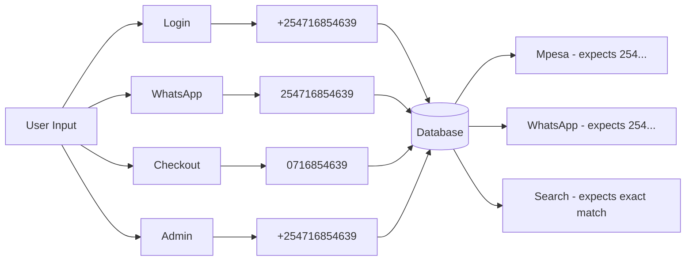
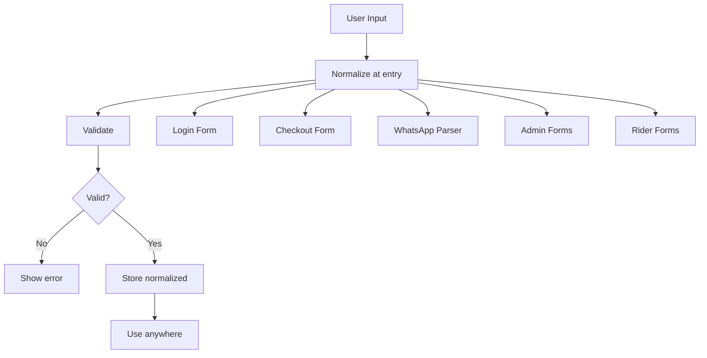

# Phone Number Handling & Normalization Audit Report
## Karebe Codebase - Full System Analysis

**Audit Date:** 2026-03-12  
** auditor:** Architecture Team  
**Scope:** Frontend, Backend, Database, APIs, Rider, Admin, Branches, Authentication, Orders, Messaging

---

## Executive Summary

The Karebe system currently has **no centralized phone number handling** - each module implements its own ad-hoc formatting logic using basic regex patterns. This creates significant risks for data consistency, duplicate records, payment failures, and messaging delivery. This report documents the current state and provides a comprehensive implementation plan.

---

## Phase 1: Current Behavior Discovery

### 1.1 Phone Number Acceptance Points

| Entry Point | Location | Current Handling |
|-------------|----------|------------------|
| Customer Login | [`karebe-react/src/features/auth/api/login.ts`](karebe-react/src/features/auth/api/login.ts:160) | Adds `+254` prefix |
| Order Creation | [`karebe-react/src/features/checkout/api/create-order.ts`](karebe-react/src/features/checkout/api/create-order.ts:14) | Passes through raw |
| WhatsApp Parser | [`karebe-react/src/features/orders/services/whatsapp-message-parser.ts`](karebe-react/src/features/orders/services/whatsapp-message-parser.ts:256) | Regex extraction |
| WhatsApp Bot | [`karebe-react/src/features/whatsapp/services/whatsapp-bot.ts`](karebe-react/src/features/whatsapp/services/whatsapp-bot.ts:215) | Normalizes to `254` (no +) |
| Mpesa Payments | [`karebe-react/src/features/payments/services/mpesa-service.ts`](karebe-react/src/features/payments/services/mpesa-service.ts:109) | Uses `254` format |
| Rider Management | [`karebe-react/src/features/admin/services/rider-manager.ts`](karebe-react/src/features/admin/services/rider-manager.ts:117) | Stores raw |
| Admin API | [`karebe-orchestration/orchestration-service/src/routes/admin.ts`](karebe-orchestration/orchestration-service/src/routes/admin.ts:659) | No validation |
| Orders API | [`karebe-orchestration/orchestration-service/src/routes/orders.ts`](karebe-orchestration/orchestration-service/src/routes/orders.ts:22) | Basic length check |

### 1.2 Database Schema

All phone fields use unconstrained `TEXT` type:

```sql
-- From karebe-orchestration/supabase/migrations/001_schema.sql
users:     phone TEXT
branches:  phone TEXT  
riders:    phone TEXT, whatsapp_number TEXT
orders:    customer_phone TEXT
```

**Issues:**
- No uniqueness constraints on phone fields
- Index exists on `customer_phone` but duplicates possible
- No format standardization at DB level

### 1.3 Current Implementation Patterns

#### Pattern 1: Customer Login ([`login.ts:163`](karebe-react/src/features/auth/api/login.ts:163))
```typescript
const formattedPhone = phone.startsWith('+') ? phone : `+254${phone.replace(/^0/, '')}`;
```
- Keeps `+` if present
- Replaces leading `0` with `+254`
- **Issue:** Doesn't handle `254` without `+`

#### Pattern 2: WhatsApp Bot ([`whatsapp-bot.ts:215`](karebe-react/src/features/whatsapp/services/whatsapp-bot.ts:215))
```typescript
private static formatPhoneNumber(phone: string): string {
  let cleaned = phone.replace(/\D/g, '');
  if (cleaned.startsWith('0')) {
    cleaned = '254' + cleaned.slice(1);
  }
  if (cleaned.startsWith('+')) {
    cleaned = cleaned.slice(1);
  }
  if (!cleaned.startsWith('254')) {
    cleaned = '254' + cleaned;
  }
  return cleaned;
}
```
- Removes all non-digits
- Output: `2547xx...` (WITHOUT `+`)
- **Issue:** Inconsistent with login format

#### Pattern 3: WhatsApp Parser ([`whatsapp-message-parser.ts:256`](karebe-react/src/features/orders/services/whatsapp-message-parser.ts:256))
```typescript
const phoneMatch = message.match(/(?:phone[:\s]+|tel[:\s]+|contact[:\s]+)?(\+?254\d{9}|0\d{9})/i);
if (phoneMatch) {
  result.phone = phoneMatch[1].replace(/\D/g, '');
  if (!result.phone.startsWith('254')) {
    result.phone = '254' + result.phone.slice(-9);
  }
}
```
- Regex limited to specific patterns
- Output: `2547xx...` (WITHOUT `+`)

#### Pattern 4: Backend Validation ([`orders.ts:22`](karebe-orchestration/orchestration-service/src/routes/orders.ts:22))
```typescript
const createOrderSchema = z.object({
  customer_phone: z.string().min(10).max(20),
  // No format validation!
});
```
- Only checks length (10-20 chars)
- Accepts ANY string in that range

### 1.4 Dependencies

**Current Libraries:** None for phone handling
- `karebe-react`: No phone library
- `karebe-orchestration-service`: No phone library

---

## Phase 2: Risk Identification

### Critical Risks

| Risk | Severity | Impact |
|------|----------|--------|
| **Duplicate Customer Accounts** | CRITICAL | Same customer creates multiple accounts with `0716854639` vs `+254716854639` |
| **Mpesa Payment Failures** | CRITICAL | Wrong format sent to Daraja API causes payment failures |
| **WhatsApp Message Failures** | HIGH | Wrong format causes message delivery failures |
| **Order Lookup Failures** | HIGH | Admin cannot find orders by phone if format differs |
| **Rider Authentication Failures** | HIGH | Rider cannot login if stored format differs from entered format |

### Inconsistencies Identified



### Specific Failure Scenarios

1. **Customer registers with `0716854639`**
   - Login stores as `+254716854639`
   - Later enters `254716854639` at checkout
   - Creates NEW customer profile (duplicate!)

2. **Mpesa STK Push**
   - Order stored with `+254716854639`
   - Sent to Mpesa as `+254716854639`
   - Daraja expects `254716854639` (no +)
   - Payment request may fail

3. **WhatsApp Order Confirmation**
   - Customer enters `0716854639` in WhatsApp message
   - Parser converts to `254716854639`
   - Bot sends to `254716854639` (without +)
   - WhatsApp API expects format with country code only

---

## Phase 3: Proposed Canonical Format

### Recommended Format: `+254XXXXXXXXX`

**Format:** `+254` + 9 digits (total 13 characters)

**Examples:**
| Input | Normalized |
|-------|------------|
| `+254716854639` | `+254716854639` |
| `254716854639` | `+254716854639` |
| `0716854639` | `+254716854639` |
| `716854639` | `+254716854639` |

### Rationale

1. **E.164 Standard** - International phone number format
2. **Mpesa Compatible** - Daraja API accepts with or without `+`
3. **WhatsApp Compatible** - Graph API accepts `254` prefix
4. **Display Friendly** - Shows country code clearly
5. **Unique** - Unambiguous worldwide

---

## Phase 4: Library Evaluation

### Options Evaluated

| Library | Pros | Cons | Recommendation |
|---------|------|------|----------------|
| **google-libphonenumber** | Complete, well-tested | Large bundle, Node-only | ❌ Not suitable |
| **libphonenumber-js** | Lightweight, browser support | Manual country detection | ✅ Recommended |
| **react-phone-number-input** | React component included | UI-focused, less control | ⚠️ Optional |
| **Custom Regex** | No dependencies | Fragile, incomplete | ❌ Current approach |

### Recommended: `libphonenumber-js`

```bash
# Install
npm install libphonenumber-js
```

```typescript
import { parsePhoneNumber, isValidPhoneNumber } from 'libphonenumber-js';

const phone = parsePhoneNumber('0716854639', 'KE');
// → PhoneNumber { country: 'KE', nationalNumber: '716854639', ... }
phone.format('E.164');
// → '+254716854639'
phone.isValid();
// → true
```

**Why libphonenumber-js:**
- ✅ Handles all Kenya formats automatically
- ✅ E.164 normalization built-in
- ✅ Validates structure (not just format)
- ✅ 5KB minified - lightweight
- ✅ TypeScript support
- ✅ Actively maintained

---

## Phase 5: Integration Plan

### 5.1 Create Phone Utility Module

Create [`karebe-react/src/lib/phone.ts`](karebe-react/src/lib/phone.ts):

```typescript
import { parsePhoneNumber, isValidPhoneNumber, CountryCode } from 'libphonenumber-js';

/**
 * Normalize phone number to E.164 format with Kenya country code
 * @param phone - Raw phone input
 * @returns Normalized phone or null if invalid
 */
export function normalizePhoneNumber(phone: string): string | null {
  if (!phone) return null;
  
  const cleaned = phone.replace(/[\s\-\(\)]/g, '');
  const parsed = parsePhoneNumber(cleaned, 'KE' as CountryCode);
  
  if (!parsed || !parsed.isValid()) return null;
  return parsed.format('E.164');
}

/**
 * Check if phone number is valid Kenyan format
 */
export function isValidKenyanPhone(phone: string): boolean {
  if (!phone) return false;
  const cleaned = phone.replace(/[\s\-\(\)]/g, '');
  const parsed = parsePhoneNumber(cleaned, 'KE' as CountryCode);
  return parsed?.isValid() ?? false;
}

/**
 * Format for display (shows as 0716 854 639)
 */
export function formatPhoneDisplay(phone: string): string {
  const normalized = normalizePhoneNumber(phone);
  if (!normalized) return phone;
  return parsePhoneNumber(normalized, 'KE' as CountryCode).formatNational();
}

/**
 * Format for Mpesa (254xxxxxxxxx without +)
 */
export function formatForMpesa(phone: string): string {
  const normalized = normalizePhoneNumber(phone);
  if (!normalized) return phone;
  return normalized.replace('+', '');
}

/**
 * Format for WhatsApp API
 */
export function formatForWhatsApp(phone: string): string {
  const normalized = normalizePhoneNumber(phone);
  if (!normalized) return phone;
  return normalized.replace('+', '');
}
```

### 5.2 Update All Entry Points



#### Updates Required:

1. **Login** ([`login.ts`](karebe-react/src/features/auth/api/login.ts))
   - Replace manual formatting with `normalizePhoneNumber()`

2. **Checkout** ([`create-order.ts`](karebe-react/src/features/checkout/api/create-order.ts))
   - Normalize before sending to API

3. **WhatsApp Parser** ([`whatsapp-message-parser.ts`](karebe-react/src/features/orders/services/whatsapp-message-parser.ts))
   - Replace regex with `normalizePhoneNumber()`

4. **WhatsApp Bot** ([`whatsapp-bot.ts`](karebe-react/src/features/whatsapp/services/whatsapp-bot.ts))
   - Replace custom function with `formatForWhatsApp()`

5. **Mpesa** ([`mpesa-service.ts`](karebe-react/src/features/payments/services/mpesa-service.ts))
   - Use `formatForMpesa()` for API calls

6. **Backend Orders** ([`orders.ts`](karebe-orchestration/orchestration-service/src/routes/orders.ts))
   - Add Zod schema validation with normalization
   - Same library works in Node.js

### 5.3 Database Migration

```sql
-- Add unique constraint on phone numbers
-- First, normalize existing data:

UPDATE users SET phone = '+254' || SUBSTR(phone, -9) 
WHERE phone LIKE '0%' OR phone LIKE '254%';

UPDATE riders SET phone = '+254' || SUBSTR(phone, -9) 
WHERE phone LIKE '0%' OR phone LIKE '254%';

-- Add unique constraints
ALTER TABLE users ADD CONSTRAINT unique_phone UNIQUE (phone);
ALTER TABLE riders ADD CONSTRAINT unique_rider_phone UNIQUE (phone);

-- For customer_profiles (may have nulls)
CREATE UNIQUE INDEX unique_customer_phone 
ON customer_profiles(phone) WHERE phone IS NOT NULL;
```

---

## Phase 6: Edge Cases

### Handled Scenarios

| Input | Normalized | Notes |
|-------|------------|-------|
| `+254716854639` | `+254716854639` | Already E.164 |
| `254716854639` | `+254716854639` | Add + prefix |
| `0716854639` | `+254716854639` | Replace 0 with +254 |
| `716854639` | `+254716854639` | Add +254 prefix |
| `+254 716 854 639` | `+254716854639` | Remove spaces |
| `+254-716-854-639` | `+254716854639` | Remove dashes |
| `(0716) 854 639` | `+254716854639` | Remove parens |

### Rejected Scenarios

| Input | Reason |
|-------|--------|
| `+255716854639` | Tanzania prefix |
| `+2541234567` | Not 9 digits |
| `1234567890` | No valid prefix |
| `abcdefghij` | Non-numeric |
| `+1-555-123-4567` | US number |
| Empty string | Required field |

### Special Cases

1. **WhatsApp extracted from contacts** - May have spaces, handle with normalization
2. **Copied from PDF receipts** - May have formatting, normalize on paste
3. **International numbers** - Should reject or prompt for Kenya number
4. **Landlines** - Should validate as mobile (Mpesa requires mobile)

---

## Phase 7: Testing Strategy

### Unit Tests

```typescript
// phone.test.ts
import { normalizePhoneNumber, isValidKenyanPhone, formatForMpesa } from './phone';

describe('normalizePhoneNumber', () => {
  it('should normalize 0716854639 to +254716854639', () => {
    expect(normalizePhoneNumber('0716854639')).toBe('+254716854639');
  });
  
  it('should normalize 716854639 to +254716854639', () => {
    expect(normalizePhoneNumber('716854639')).toBe('+254716854639');
  });
  
  it('should normalize +254716854639 to +254716854639', () => {
    expect(normalizePhoneNumber('+254716854639')).toBe('+254716854639');
  });
  
  it('should normalize 254716854639 to +254716854639', () => {
    expect(normalizePhoneNumber('254716854639')).toBe('+254716854639');
  });
  
  it('should return null for invalid number', () => {
    expect(normalizePhoneNumber('invalid')).toBeNull();
  });
  
  it('should return null for Tanzania number', () => {
    expect(normalizePhoneNumber('+255716854639')).toBeNull();
  });
});

describe('formatForMpesa', () => {
  it('should format +254716854639 as 254716854639', () => {
    expect(formatForMpesa('+254716854639')).toBe('254716854639');
  });
});

describe('isValidKenyanPhone', () => {
  it('should validate correct Kenyan mobile', () => {
    expect(isValidKenyanPhone('+254716854639')).toBe(true);
  });
  
  it('should reject landline', () => {
    expect(isValidKenyanPhone('+254202000000')).toBe(false);
  });
});
```

### Integration Tests

```typescript
// Verify end-to-end flow
describe('Phone Number E2E', () => {
  it('should find same customer with different input formats', async () => {
    // Login with 0716854639
    await customerLogin('0716854639');
    
    // Create order with 254716854639  
    await createOrder({ phone: '254716854639', ... });
    
    // Should find same customer
    const orders = await getOrdersByPhone('+254716854639');
    expect(orders.length).toBe(1);
  });
});
```

---

## Implementation Roadmap

### Phase 1: Foundation (Priority: Critical)
- [ ] Install `libphonenumber-js` in both projects
- [ ] Create phone utility module
- [ ] Add comprehensive unit tests

### Phase 2: Frontend Updates (Priority: High)
- [ ] Update login form validation
- [ ] Update checkout form validation
- [ ] Update WhatsApp message parser
- [ ] Update WhatsApp bot formatting

### Phase 3: Backend Updates (Priority: High)
- [ ] Update order creation validation
- [ ] Update rider management validation
- [ ] Update admin user validation

### Phase 4: Database (Priority: High)
- [ ] Run data normalization migration
- [ ] Add unique constraints

### Phase 5: Payment Integration (Priority: High)
- [ ] Update Mpesa service formatting
- [ ] Test full payment flow

### Phase 6: Monitoring (Priority: Medium)
- [ ] Add logging for phone normalization failures
- [ ] Track duplicate customer incidents

---

## Summary

The Karebe system currently accepts phone numbers in multiple formats but lacks consistent normalization. This creates risks of:
- Duplicate customer records
- Payment failures  
- Message delivery issues
- Broken search functionality

**Solution:** Implement centralized phone number handling using `libphonenumber-js` with `+254XXXXXXXXX` as the canonical format. Apply normalization at all entry points and use consistently throughout the system.

**Estimated Effort:** 2-3 days for full implementation
**Risk Reduction:** Critical issues resolved
**Data Quality:** Immediate improvement in customer data integrity